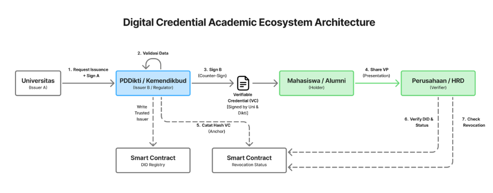
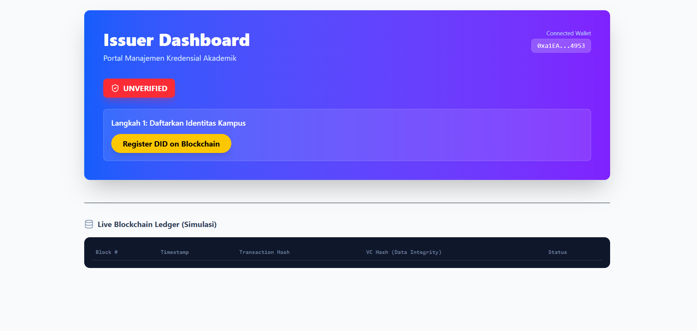

# Digital Credential Academic System


Proyek ini membangun ekosistem dokumen akademik digital (seperti ijazah dan transkrip) yang aman, resmi, dan mudah diverifikasi. Layaknya ijazah fisik yang memiliki stempel basah, sistem ini memberikan "stempel digital" dari Universitas dan Kemendikbud (PDDikti) yang tidak bisa dipalsukan.

Mahasiswa dapat menyimpan ijazah ini di dompet digital (aplikasi) mereka sendiri. Saat melamar kerja, perusahaan dapat memverifikasi keaslian ijazah tersebut dalam hitungan detik tanpa perlu menghubungi pihak kampus secara manual berkat teknologi Blockchain yang menjamin data valid dan transparan.

## 📑 Daftar Isi

- [📖 Latar Belakang](#📖-latar-belakang)
- [⚠️ Permasalahan](#⚠️-permasalahan)
- [🎯 Tujuan](#🎯-tujuan)
- [💻 Arsitektur Sistem](#💻-arsitektur-sistem)
- [🛠 Teknologi yang Digunakan](#🛠-teknologi-yang-digunakan)
- [🚀 Cara Menjalankan Program](#🚀-cara-menjalankan-program)
- [💡 Kesimpulan](#💡-kesimpulan)
- [🙎 Kontributor](#🙎-kontributor)

## 📖 Latar Belakang

Dalam dunia pendidikan dan profesional saat ini, terdapat beberapa isu mendasar yang melatarbelakangi pengembangan sistem ini:

- **Pemalsuan Dokumen**: Pemalsuan ijazah dan sertifikat profesional masih sering terjadi dan sulit dibedakan dari dokumen asli secara fisik.
- **Inefisiensi Verifikasi**: Proses verifikasi manual antara lembaga pendidikan, pemerintah, dan perusahaan cenderung lambat dan tidak efisien.
- **Ketergantungan Identitas**: Identitas digital pengguna akademik saat ini masih bergantung sepenuhnya kepada institusi (sentralisasi), sehingga individu tidak memiliki kendali penuh.
- **Masalah Kepercayaan**: Kondisi ini menimbulkan masalah kepercayaan (trust) dan validasi dalam ekosistem pendidikan serta rekrutmen tenaga kerja.

## ⚠️ Permasalahan

Sistem konvensional yang terpusat (seperti PDDikti) memiliki kelemahan:

- **Single Point of Failure**: Risiko gangguan teknis atau kehilangan data (contoh kasus: data ratusan mahasiswa tidak tercantum atau gangguan pencarian data).
- **Birokrasi Panjang & Rawan Manipulasi**: Proses administrasi yang berbelit memungkinkan celah manipulasi data.
- **Kegagalan Sinkronisasi**: Sering terjadi ketidaksesuaian data antar lembaga.
- **Kurangnya Kendali User**: Individu tidak memiliki kendali penuh atas data pendidikan mereka sendiri.

## 🎯 Tujuan

Sistem ini bertujuan untuk:

- **Implementasi SSI**: Menerapkan model Self-Sovereign Identity di mana pengguna memiliki kendali penuh atas identitas mereka.
- **Desentralisasi Identitas (DID)**: Mengelola Decentralized Identifiers agar tidak bergantung pada satu otoritas tunggal.
- **Penerbitan Aman**: Menerbitkan Verifiable Credentials (VC) yang kriptografis dan tidak bisa dipalsukan.
- **Verifikasi Transparan**: Memungkinkan verifikasi dokumen secara langsung tanpa perantara pihak ketiga.

## 💻 Arsitektur Sistem

<p align="center">
  
</p>

**Alur sesuai diagram:**

1. **Universitas** (Issuer A) meminta penerbitan credential ke **PDDikti/Kemendikbud** (Issuer B / Regulator) dan menandatangani (Sign A).
2. **PDDikti** melakukan validasi data, melakukan counter-sign (Sign B).
3. Terbentuk **Verifiable Credential (VC)** yang ditandatangani Uni + Dikti.
4. VC dikirim ke **Mahasiswa / Alumni** (Holder) — disimpan di Holder Wallet atau Cloud Agent.
5. PDDikti / Universitas mencatat ringkasan/hash VC ke **Smart Contract** (anchoring) — DID Registry & Revocation Registry.
6. Holder membagikan **Verifiable Presentation (VP)** ke **Perusahaan / HR** (Verifier).
7. Verifier memverifikasi signature, memeriksa DID registry (status terdaftar), dan memeriksa revocation status pada smart contract sebelum menerima.

**Komponen Utama:**

- **Cloud Agent** (server): Inbox, relay VC/VP, opsional agent DID/keys.
- **Issuer Portal**: UI untuk menerbitkan VC, men-trigger anchoring.
- **Holder Wallet**: UI untuk menyimpan VC dan membuat VP.
- **Verifier Portal**: UI/API untuk menerima VP & verifikasi offline.
- **Smart Contracts**: DID registry (pendaftaran DID) & Revocation registry (catat/hapus hash VC).

## 🛠 Teknologi yang Digunakan

### Frontend

- **TypeScript**: Bahasa pemrograman utama yang digunakan untuk menjamin type safety, meminimalisir bug saat pengembangan, dan memudahkan maintenance kode.
- **React (Vite + TypeScript)**: Digunakan untuk membangun antarmuka pengguna (Issuer, Holder, Verifier) karena performanya yang cepat sebagai Single Page Application (SPA).
- **TailwindCSS**: Framework CSS utility-first untuk mempercepat proses styling UI agar responsif dan konsisten.

### Backend

- **Express.js**: Framework minimalis untuk Node.js yang digunakan pada Cloud Agent untuk menangani API request, komunikasi antar agent, dan relay data kredensial.

### Blockchain

- **Solidity**: Bahasa pemrograman berorientasi objek untuk menulis Smart Contract pada jaringan Ethereum/EVM.
- **Ethers.js**: Library untuk menghubungkan aplikasi frontend dengan Blockchain (interaksi wallet, anchoring, revocation, dan DID registry).
- **Foundry (Forge, Anvil, Cast)**:
  - **Forge**: Untuk build, test, dan deploy smart contract.
  - **Anvil**: Node Ethereum lokal untuk simulasi blockchain yang cepat (pengganti Ganache).
  - **Cast**: Tool CLI untuk berinteraksi langsung dengan smart contract.
- **Metamask**: Dompet kripto (browser extension) yang digunakan user untuk manajemen akun dan otorisasi transaksi (signing).

## 🚀 Cara Menjalankan Program

Pastikan sudah menginstall **Node.js**, **Foundry**, dan **Git**.

### 0. Persiapan Blockchain (Wajib dijalankan pertama)

Sebelum menjalankan aplikasi, blockchain lokal harus aktif.

```bash
cd blockchain
# Jalankan local node
anvil

# Buka terminal baru, lalu deploy contract
forge create --rpc-url http://127.0.0.1:8545 --private-key <PRIVATE_KEY_DEPLOYER> src/DigitalIdentity.sol:DigitalIdentity
```

### 1. Cloud Agent

Service ini harus menyala agar Issuer dan Holder bisa berkomunikasi.

```bash
cd apps/cloud-agent
npm install react-router-dom lucide-react ethers
npm start
```

### 2. Issuer Portal

Portal untuk Universitas/PDDikti menerbitkan ijazah.

```bash
cd apps/issuer-portal
npm install react-router-dom lucide-react ethers
npm run dev
```



### 3. Holder Wallet

Aplikasi dompet digital untuk Mahasiswa.

```bash
cd apps/holder-wallet
npm install react-router-dom lucide-react ethers
npm run dev
```


### 4. Verifier App

Aplikasi untuk Perusahaan memverifikasi ijazah.

```bash
cd apps/verifier-portal
npm install
npm run dev
```


## 💡 Kesimpulan

Sistem ini menciptakan ekosistem kredensial akademik digital berskala nasional. Dengan sistem ini:

- Setiap ijazah/sertifikat memiliki jejak digital yang dapat diverifikasi (verifiable).
- Setiap individu memiliki identitas akademik yang dapat dipercaya secara global.
- Blockchain menghadirkan paradigma baru dalam membangun kepercayaan tanpa perantara (trustless), menciptakan ekosistem pendidikan yang transparan, aman, dan terpercaya.

## 🙎 Kontributor

- Rakha Dhifiargo Hariadi
- Defrizal Yahdiyan Risyad